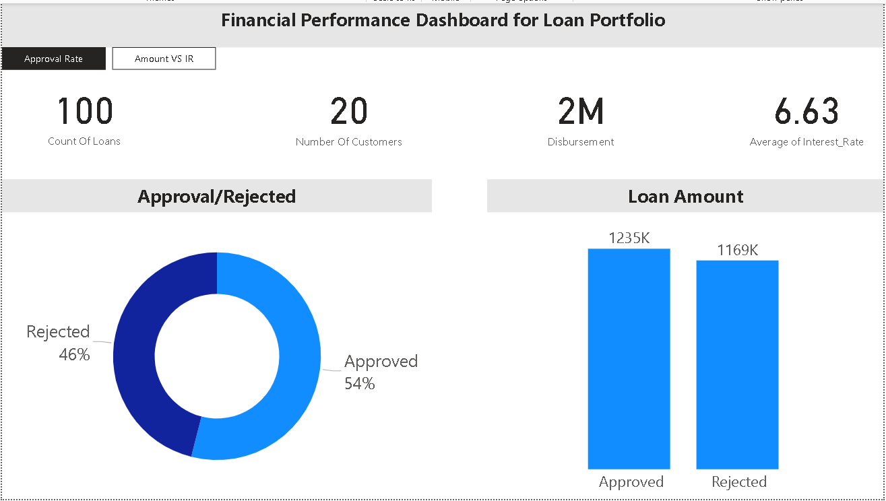

#**Financial Performance Dashboard for Loan Portfolio**

#Case Study: Financial Performance Dashboard for Loan Portfolio

**Background:**
ABC Finance Company is a leading financial institution specializing in providing loans to individuals and businesses. As part of their commitment to data-driven decision-making, they are seeking a skilled Power BI developer to create a Financial Performance Dashboard for their loan portfolio.

**Job Role Description:**
The Power BI developer will be responsible for constantly reviewing and analyzing the company's loan data and suggesting optimizations in processes, products, and technologies. They should have a strong knowledge of Power BI, MS Excel, SQL, and excellent mathematical skills to measure and analyze data. The developer must work independently, learn quickly, and adapt to different situations with a sense of ownership and accountability.

**Project Objective:**
The project aims to create a comprehensive Financial Performance Dashboard to provide insights into ABC Finance Company's loan portfolio. This dashboard will assist in assessing loan performance, identifying trends, and supporting informed decision-making.

#**Project Steps:**

**Data Import (SQL):**

Thedata is imported into a SQL database. A table called 'LoanPortfolio' is created to store this data.

**Data Preprocessing (Excel):**

The data is downloaded from the SQL database and loaded into Excel for further processing.
Data preprocessing tasks include cleaning, transformation, and calculating additional metrics such as total interest.
Data Visualization (Power BI):

**The preprocessed data is imported into Power BI.**
The Power BI developer creates a series of interactive reports and dashboards, focusing on key aspects of the loan portfolio:

Loan approval rates over time.
Distribution of loan amounts.
Trends in interest rates.
Customer segmentation based on loan history.
Breakdown of loan statuses (approved vs. rejected).

The dashboard is designed to allow users to filter data dynamically and explore loan performance in detail.

**Outcomes and Benefits:**
The Financial Performance Dashboard developed by the Power BI developer provides ABC Finance

**Company with several benefits:**

Enhanced decision-making: The dashboard enables quick access to critical loan performance metrics, aiding in making informed decisions regarding loan products and processes.

**Improved data visibility:** By visualizing data, the company gains a clearer understanding of its loan portfolio and can identify areas for optimization.
Efficiency gains: Automation of data extraction, analysis, and reporting streamlines processes, saving time and resources.

**Conclusion:**
The Financial Performance Dashboard project demonstrates the Power BI developer's ability to use their skills in Power BI, Excel, SQL, and Python to create valuable insights for ABC Finance Company. This project analyze data and suggest optimizations, ultimately contributing to the company's financial success and data-driven culture.