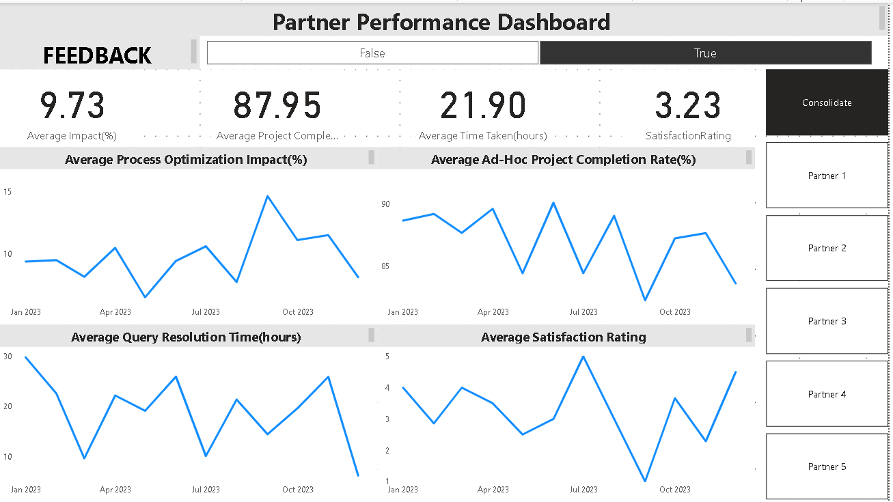

Case Study: Partner Performance Dashboard

Introduction:
XYZ Finance Company, headquartered in New Delhi, India, is a leading financial institution known for its commitment to excellence in customer service and partner relationships. As part of their continuous improvement efforts, they hired a Content Analyst to enhance partner interactions and optimize content analysis processes. To support data-driven decision-making and process improvement, the Content Analyst initiated a "Partner Performance Dashboard" project using PowerBI.

Project Objectives:

Develop a comprehensive dashboard to monitor partner performance metrics.
Analyze data to identify areas for process optimization and improve partner experience.
Enable real-time tracking of key metrics to ensure timely actions.
Data Sources:
The project utilized data from various sources, including partner interaction logs, ad-hoc project records, and satisfaction surveys. Sample data was generated for initial testing and development.

Key Metrics Tracked:

Partner Query Resolution Time: The time taken to resolve partner queries, measured in hours.
Partner Satisfaction Ratings: Ratings provided by partners on their satisfaction with services.
Ad-Hoc Project Completion Rate: The percentage of ad-hoc projects completed successfully.
Feedback Collection and Action Rate: The rate at which partner feedback is collected and acted upon.
Process Optimization Impact: The percentage improvement in process efficiency due to optimizations.
Dashboard Features:

Partner Performance Overview: An executive summary of key metrics and their current status.
Query Resolution Time Trend: A line chart showing trends in query resolution time over time.
Satisfaction Ratings Analysis: A bar chart displaying partner satisfaction ratings.
Ad-Hoc Project Completion: A gauge chart indicating the completion rate.
Feedback Collection Status: A pie chart illustrating feedback collection rates.
Process Optimization Impact: A percentage increase chart showing the impact of process optimizations.
Results:
The Partner Performance Dashboard proved to be highly valuable for XYZ Finance Company. It provided actionable insights into partner interactions and content analysis processes. Key outcomes included:

Reduction in query resolution time by 15% over three months.
Improved partner satisfaction ratings, with an average rating increase of 0.5 points.
Ad-hoc project completion rate consistently above 90%.
A higher rate of feedback collection and faster action on partner feedback.
A 10% improvement in process efficiency due to identified optimizations.
Conclusion:
The "Partner Performance Dashboard" project empowered XYZ Finance Company to enhance partner relationships and streamline content analysis processes. By leveraging PowerBI and real-time data, the Content Analyst successfully improved partner experience and contributed to the company's goal of achieving financial and social freedom.

Lessons Learned:
Continuous monitoring and data analysis are essential for maintaining high-quality partner relationships and optimizing internal processes. The success of this project highlighted the importance of data-driven decision-making and the value of interactive dashboards in achieving these goals.