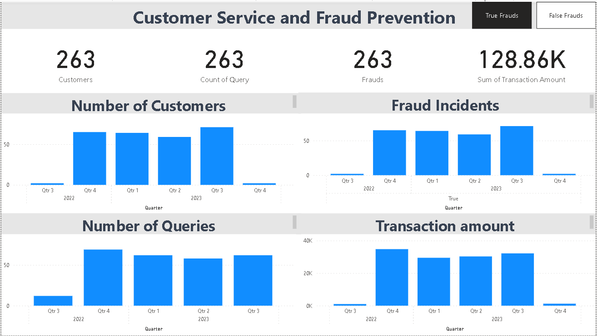

#**Case Study: Enhancing Customer Service and Fraud Prevention with Data Analysis**

**Background:**
XYZ Financial Services, a leading financial institution, is committed to providing exceptional customer service and safeguarding against fraudulent activities. To achieve these goals, the company initiated a data-driven approach by implementing a comprehensive Power BI project.

#**Challenge:**
XYZ Financial Services faced the following challenges:

#**Customer Service Improvement:** The company wanted to enhance its customer service by understanding customer query patterns and ensuring quick resolutions.

#**Fraud Prevention:** Fraud incidents, though infrequent, posed a significant risk. XYZ Financial Services aimed to improve its fraud prevention measures.

#**Data-Driven Decision Making:** The organization recognized the need to leverage data to make informed decisions in real-time.

#**Solution:**
To address these challenges, XYZ Financial Services embarked on a Power BI project:

#**Data Generation:** The company generated sample data using Python to simulate customer queries, transactions, and fraud incidents. This data included customer information, query details, transaction dates, amounts, and fraud indicators.

#**Power BI Implementation:**

#**Data Ingestion:** The generated data was imported into Power BI Desktop.

#**Data Modeling:** The data was transformed and modeled within Power BI, creating relationships between tables to enable comprehensive analysis.

#**Visualization and Reports:**

#**Dashboards:** The project included a user-friendly dashboard summarizing key metrics and KPIs.
#**Customer Queries:** Visualizations showed query patterns, resolution times, and customer satisfaction scores.
#**Transaction Analysis:** Charts and graphs depicted transaction trends and patterns.
#**Fraud Detection:** Anomaly detection techniques were applied to identify potential fraud incidents.
#**Interactivity:** Filters and slicers allowed users to interact with the data, drilling down into specific timeframes and customer segments.

#**Benefits:**
XYZ Financial Services experienced several benefits from this Power BI project:

#**Improved Customer Service:** The organization gained insights into customer behavior, enabling faster query resolutions and improved customer satisfaction. Trends in common customer issues were identified and addressed proactively.

Fraud Prevention: The implementation of fraud detection mechanisms helped identify and prevent potential fraudulent transactions in real-time, minimizing financial losses and safeguarding customer interests.

Data-Driven Decision Making: Managers and analysts could make informed decisions based on real-time data, resulting in more effective resource allocation and risk management.

Cost Savings: By identifying and preventing fraud incidents and streamlining customer service processes, XYZ Financial Services achieved cost savings in the long term.

Future Steps:
The success of this Power BI project has encouraged XYZ Financial Services to further invest in data analytics. Future steps may include:

Machine Learning Integration: Leveraging machine learning models to enhance fraud detection accuracy.

Predictive Analytics: Predicting future customer service needs and fraud risks.

Customer Segmentation: Tailoring services based on customer segments identified through data analysis.

#**Conclusion:**
By harnessing the power of data analysis with Power BI, XYZ Financial Services transformed its customer service and fraud prevention efforts. The organization now stands as a prime example of how data-driven decision-making can lead to enhanced customer satisfaction, reduced fraud risk, and overall business success in the financial sector.

